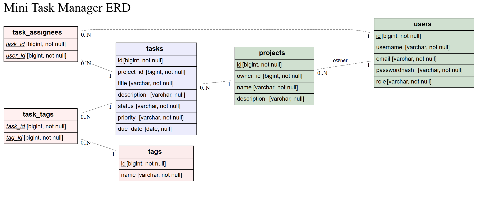

# Dossier

- Student: Yoran De Rop De Beukelaer
- Studentennummer: 202292109
- E-mailadres: <mailto:yoran.deropdebeukelaer@student.hogent.be>
- Demo: <[DEMO_LINK_HIER](https://hogent.cloud.panopto.eu/Panopto/Pages/Sessions/List.aspx?folderID=53cacd06-6331-4266-8853-b24d009d26f0)>
- GitHub-repository: <[GITHUB_REPO_LINK_HIER](https://github.com/HOGENT-frontendweb/frontendweb-2425-YoranDRDB/tree/main)>
- Web Services:
  - Online versie: <[LINK_ONLINE_VERSIE_HIER](https://frontendweb-2425-yorandrdb.onrender.com)>

## Logingegevens

### Lokaal

Gebruikersnaam/e-mailadres: <user@hogent.be>
Wachtwoord: wachtwoord12345

### Online

Gebruikersnaam/e-mailadres: <test.user@hogent.be>
Wachtwoord: wachtwoord12345

## Projectbeschrijving

Dit project betreft een Task Management System dat gebruikers in staat stelt om projecten en taken efficiënt te beheren. Gebruikers kunnen zich registreren, inloggen, en projecten aanmaken waarbinnen zij taken kunnen toevoegen, bijwerken en verwijderen. Administrators hebben extra bevoegdheden, zoals het beheren van alle gebruikers en projecten.

### Domeinmodel

Het domeinmodel voor dit project bestaat uit de volgende entiteiten:

Gebruiker (User): Beheert gebruikersgegevens zoals gebruikersnaam, e-mailadres en rol.
Project: Beheert projecten met een naam en beschrijving.
Taak (Task): Beheert taken binnen projecten, inclusief titel, beschrijving, status, prioriteit en vervaldatum.
Tag(tags):beheert de tags binnen die aan de taken vast hangen bv: of het front/back ofeen andere vorm is.

> <https://kroki.io/erd/svg/eNqlVE1vwjAMvedXWHCDIXXXnceRC9oNTcikbustJFXiDk2I_75-MUpVKWg7Nn72e_azKyyG4GzwQOYFZhu2DG8YPmGDFnPysN6-zi5KzWFthYUpKLWrAvnwDudDrp1xvs6bpwklaVIjARac3goeOGcrT2CdgK2MaRFNvsXjgPcLvS7Qj3B0RDYxUIkhnJxPCwxFDOudiZCqXendB2n5T3_uZMnvo7BHRpBS0J5LYWenoFfRUls2UkyadKYfVNw3Hdcs9_vyD9EAQVCqEPXXs_Ms31HSivYpykBc83U3o3w0okw3Q3pwRHG3Ohv29T5ybonGZFmWZP0GLVtglHKxbC4lhutpJ9r7C2NdJko4hy0ZbOwNBZf1H-F6M7BYrZ7b8x7Y2l7D7AKg2i3tML8Z3ettaF24Q07HuvJ9rOl6ImX4nAf1A9hRoNs=> > 

## API calls

### Gebruikers

- `GET /users`: Haal alle gebruikers op.
- `POST /users`: Creëer een nieuwe gebruiker.
- `GET /users/:id`: Haal een specifieke gebruiker op.
- `PUT /users/:id`: Update een specifieke gebruiker.
- `DELETE /users/:id`: Verwijder een specifieke gebruiker.

### Projecten

- `GET /projects`: Haal alle projecten op.
- `POST /projects`: Creëer een nieuw project.
- `GET /projects/:id`: Haal een specifiek project op.
- `PUT /projects/:id`: Update een specifiek project.
- `DELETE /projects/:id`: Verwijder een specifiek project.

### Taken

- `GET /tasks`: Haal alle taken op.
- `POST /tasks`: Creëer een nieuwe taak.
- `GET /tasks/:id`: Haal een specifieke taak op.
- `PUT /tasks/:id`: Update een specifieke taak.
- `DELETE /tasks/:id`: Verwijder een specifieke taak.

### Sessions

- `POST /sessions`: Log in als gebruiker.
- `DELETE /sessions`: Log uit.

## Behaalde minimumvereisten

### Web Services

#### Datalaag

- [x ] voldoende complex en correct (meer dan één tabel (naast de user tabel), tabellen bevatten meerdere kolommen, 2 een-op-veel of veel-op-veel relaties)
- [ x] één module beheert de connectie + connectie wordt gesloten bij sluiten server
- [ x] heeft migraties - indien van toepassing
- [ x] heeft seeds

#### Repositorylaag

- [ x] definieert één repository per entiteit - indien van toepassing
- [ x] mapt OO-rijke data naar relationele tabellen en vice versa - indien van toepassing
- [ x] er worden kindrelaties opgevraagd (m.b.v. JOINs) - indien van toepassing

#### Servicelaag met een zekere complexiteit

- [ x] bevat alle domeinlogica
- [ x] er wordt gerelateerde data uit meerdere tabellen opgevraagd
- [ x] bevat geen services voor entiteiten die geen zin hebben zonder hun ouder (bv. tussentabellen)
- [ x] bevat geen SQL-queries of databank-gerelateerde code

#### REST-laag

- [ x] meerdere routes met invoervalidatie
- [x ] meerdere entiteiten met alle CRUD-operaties
- [x ] degelijke foutboodschappen
- [ x] volgt de conventies van een RESTful API
- [x ] bevat geen domeinlogica
- [ x] geen API calls voor entiteiten die geen zin hebben zonder hun ouder (bv. tussentabellen)
- [ x] degelijke autorisatie/authenticatie op alle routes

#### Algemeen

- [x ] er is een minimum aan logging en configuratie voorzien
- [x ] een aantal niet-triviale én werkende integratietesten (min. 1 entiteit in REST-laag >= 90% coverage, naast de user testen)
- [x ] node_modules, .env, productiecredentials... werden niet gepushed op GitHub
- [ x] minstens één extra technologie die we niet gezien hebben in de les
- [x ] maakt gebruik van de laatste ES-features (async/await, object destructuring, spread operator...)
- [ x] de applicatie start zonder problemen op gebruikmakend van de instructies in de README
- [x ] de API draait online
- [x ] duidelijke en volledige README.md
- [ ] er werden voldoende (kleine) commits gemaakt
- [ x] volledig en tijdig ingediend dossier

## Projectstructuur

project-root/
├── src/
│ ├── rest/
│ │ ├── projects.ts
│ │ ├── users.ts
│ │ ├── tasks.ts
│ │ ├── tags.ts
│ │ ├── session.ts
│ │ └── health.ts
│ ├── service/
│ │ ├── project.ts
│ │ ├── user.ts
│ │ ├── task.ts
│ │ ├── tag.ts
│ │ └── session.ts
│ ├── core/
│ │ ├── auth.ts
│ │ └── validation.ts
│ ├── types/
│ │ ├── koa.ts
│ │ ├── user.ts
│ │ ├── project.ts
│ │ ├── task.ts
│ │ ├── tag.ts
│ │ ├── session.ts
│ │ └── common.ts
│ └── index.ts
├── apidoc/
│ └── index.html
├── package.json
├── tsconfig.json
└── README.md

- `src/rest/`: Bevat alle route handlers (zoals projects.ts, users.ts, etc.) die de API-endpoints definiëren. Deze bestanden bevatten de apidocjs commentaarblokken die nodig zijn voor de documentatie.
- `src/service/`: Bevat de business logic voor verschillende entiteiten zoals projecten, gebruikers, taken, enz.
- `src/core/`: Bevat kernfunctionaliteiten zoals authenticatie (auth.ts) en validatie (validation.ts).
- `src/types/`: Bevat TypeScript type definities voor verschillende onderdelen van de applicatie.
- `apidoc/`: Dit is de outputmap waar apidocjs de gegenereerde documentatie zal plaatsen.

## Extra technologie

### apidoc

apidoc is een tool voor het automatisch genereren van API-documentatie uit commentaarblokken in je code. Het maakt het gemakkelijk om gedetailleerde en gestructureerde documentatie te creëren die synchroon loopt met je codebase.

Werking: apidoc leest de commentaarblokken die zijn gemarkeerd met specifieke tags (@api, @apiParam, etc.) in je code en genereert een statische HTML-documentatiepagina. Hierdoor blijft de documentatie altijd up-to-date met de huidige staat van je API.

## Gekende bugs

Als er sommige dingen worden verwijdert krijg je een generieke foutmelding in plaats van een specifieke. bv als er een project wordt verwijderd waar nog tasks aan vast hangen. Dit kan soms wel vreselijk irritant zijn.

## Reflectie

Ik vond het heel erg moeilijk ik heb mij verschillende keren volledig en hopeloos vast gebeten op iets waar ik vervolgens te koppig was om dan vanaf te stappen waardoor ik het verschillende kleren aan de kant heb geschoven als iets voor later en het eigenlijk een beetje heb laten liggen op de achtergrond zelfs op een bepaald moment. Ik vond het ook jammer dat ik uiteindelijk niet super veel heb ge experimenteerd.
